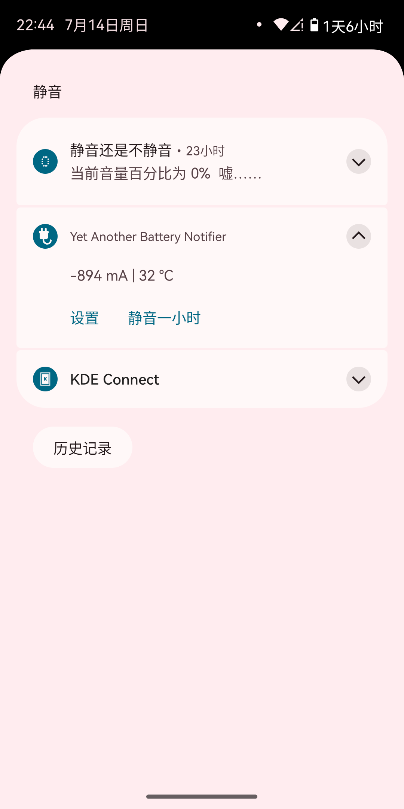
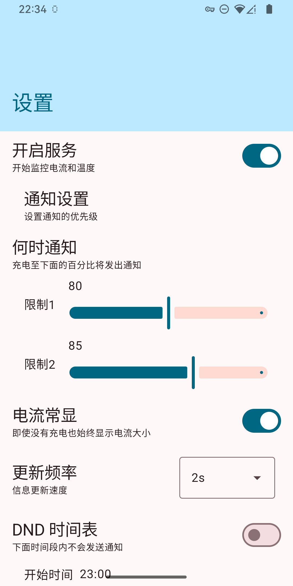
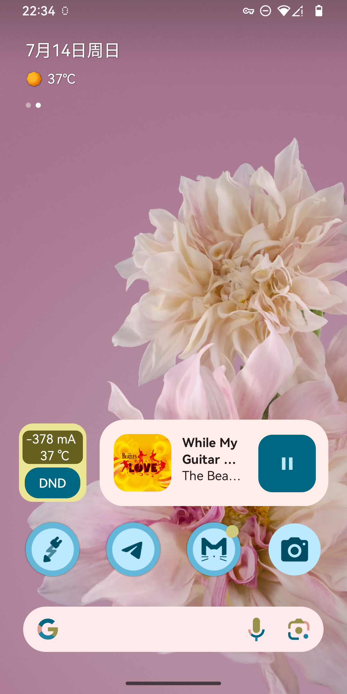

# Yet Another Battery Notifier

## 功能

||||
| :---: | :---: |:---:|
|通知|设置|微件|

- （默认）在充电且亮屏状态下显示充电电流及电池温度。
  设置项中可选非充电状态时也显示充电电流及温度。
- 当电量分别充至 80% 和 85% 时发出提醒通知。

## 特点

- 不请求任何非必须权限，启动/停止服务通过 Quick Settings 磁贴或设置 Activity
- 后台只需要两个服务
  - 前台服务：用来避免被系统杀掉，且负责注册必要广播接收器以在充电 & 亮屏状态下显示电流，提醒电量
  - 快速设置磁贴服务：用以实现快速磁贴功能

## 问题

- 没有测试，大爆炸式开发
- 由于各家通知/后台管理策略不同，不同设备上效果可能不同
  或需要自己根据实际情况对通知/后台设置进行调整
- 蹩脚英文
- 修改设置需要重启服务
